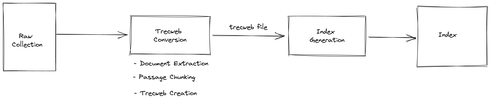

# Offline Index Preparation Pipeline

The `offline` pipeline downloads and prepares the raw collection for use within the online system. The core steps of the pipeline are:

## Trecweb Conversion

Indexes are generated with `.trecweb` files. As such, the first step is to convert the raw collection to a `.trecweb` file. This step consists of sub-steps where each document in the collection is extracted, chunked into passages, and written to a `.trecweb` file.

### Document Extraction

For each document, the pipeline extracts the id, url, title, and body.

### Passage Chunking

The body of each document is chunked into passages. A passage is the basic unit of a search result.

### Trecweb Creation

A trecweb representation of the document and its attributes is created and appended to the final `.trecweb` file.  

## Index Generation

The files generated from the Trecweb Conversion step are used to create a lucene index.

# How to run

1. Download the duplicate files and the raw collections (This might take a while!). CAsT Y3 uses documents from the MARCO, KILT, and WaPo document collections. The script will request the password to access the WaPo collection as a license is required for it.

`bash download_files.sh`

2. Build the ``offline` docker image:

`docker build -t cast-searcher-offline-image .`

3. Run and exec into the docker image, mounting the current directory and `shared` directory as volumes:

`docker run -it -v $PWD/../shared:/shared -v $PWD:/source cast-searcher-offline-image bash`

4. Finally, run `python3 main.py` to kick off the pipeline. If using the Spacy Passage Chunker on the entire corpus, it will take roughly 10 hours to complete depending on the compute resources available on your machine where it is run. 

You can pass in arguments to the script to customize how it is run too. Possible arguments can be found in lines 10 - 32 of the `main.py` file.  For example, if you only want to generate the .trecweb file for each collection but not index them, do `python3 main.py --skip-indexing`.